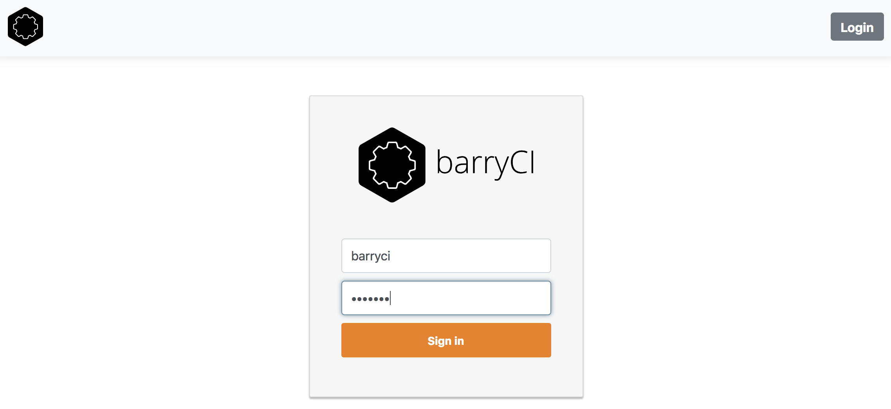
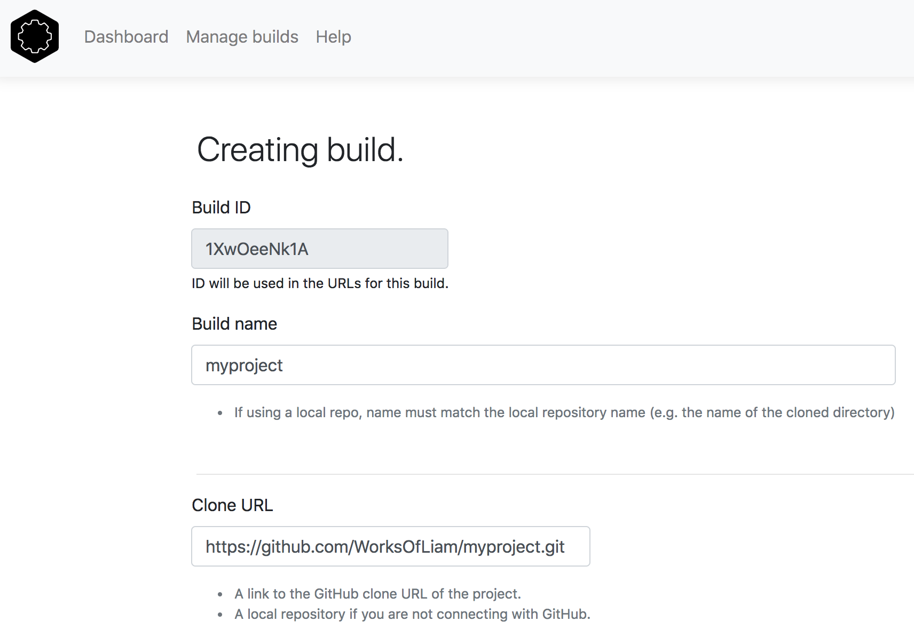
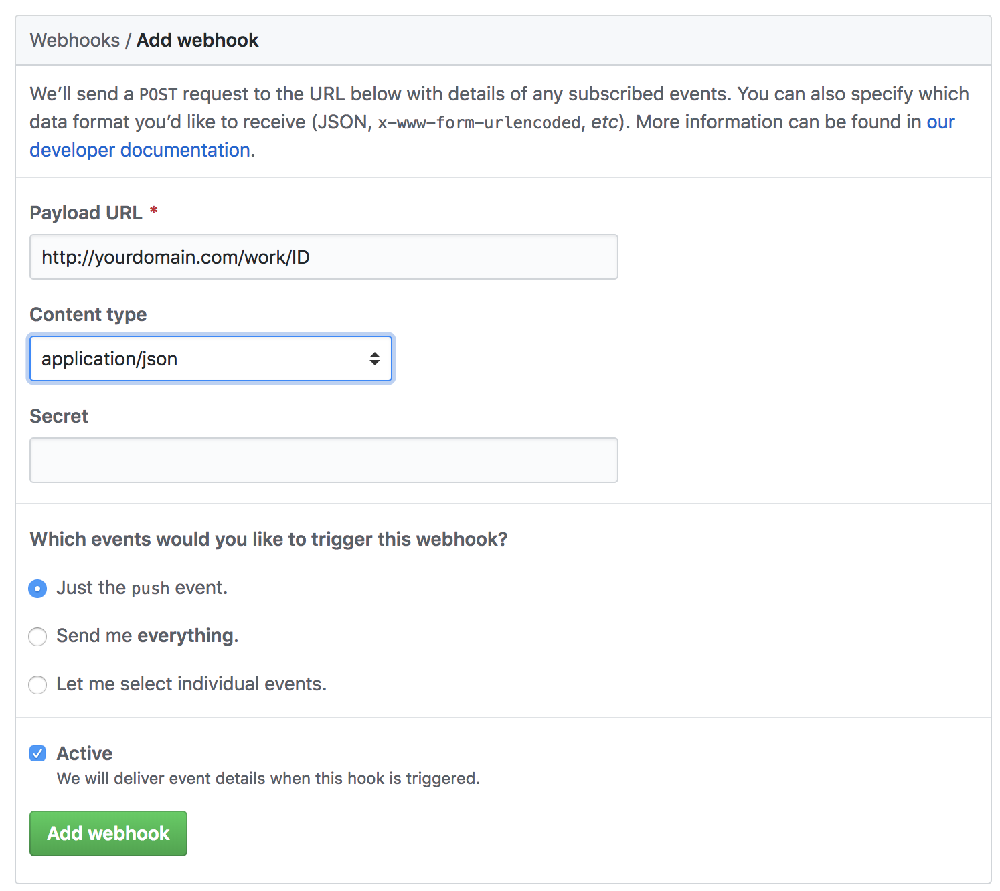

# barryCI Basics

This chapter will cover the installation and setup of barryCI on a development server. barryCI can be used to keep master libraries up to date automatically or to deploy to test/production environments. barryCI is tightly integrated with GitHub, so will show you the process using repositories hosted on GitHub.

## Installation

barryCI is written for Node.js and therefore requires the Node.js runtime. To install Node.js on IBM i, you can use yum:

```
yum install nodejs10.ppc64
```

Once you have Node.js installed, you can test what version you have with `node -v`. Since you will want barryCI to be always running, you can install `pm2` with the `npm` command.

```
npm install -g pm2
```

pm2 allows you to manage Node.js applications that run on your systems. Since we are using the 'install globally' flag (`-g`), you will want to alter your `$PATH` (and also your `.profile`!) to be able to use the `pm2` command:

```
PATH=/QOpenSys/pkgs/lib/nodejs10/bin:$PATH
```

Now, to install barryCI, you need to clone the application from GitHub:

1. `git clone https://github.com/WorksOfBarry/barryCI.git` to get the source.
2. `npm i` to install the dependencies.
3. `node index` and then `Control+C` to stop the app. This will generate `config.json`.
4. Change your `config.json` to your needs (see Configuring the server below) and then start the app with pm2: `pm2 start index.js`

When you start a process using pm2, it will fork the process it was started from (e.g. your session) and therefore will run under your user profile. You can access barryCI by going to `youribmi:port/login` and using the login you setup in the configuration.

Note that you will only have to install Node.js, pm2 and barryCI once on each system you want to use barryCI on.

## Configuring the server

The only place you need to do any setup is in the `config.json`, which is generated the first time you start the app. These are the attributes you need to setup correctly:

* `address` - the remote address the app will used.
* `port` - the port number for the app.
* `store_stdout` - if true, standard out will not be stored if successful. Standard error is always saved.
* `login` - the login which can is used from the web application.

That's the only configuration required before running barryCI.

## Configuring a project

For a project to be compatible with barryCI, a file called `barryci.json` needs to be in the root. The `barryci.json` consists of what commands will run when a build is triggered - like building a `makefile`.

Let's say our project structure was the following:

```
/.git
makefile
barryci.json
/qrpglesrc
  programa.rpgle
  programb.rpgle
  programc.rpgle
/qsqlsrc
  customers.sql
  inventory.sql
/qcllesrc
  startjob.cmd
/qcmdsrc
  startjob.cmd
```

Notice that we have a `barryci.json` in the root. The following example is setup to execute GNU Make when a build is triggered by barryCI:

```json
{
  "build": [{
    "command": "gmake",
    "args": ["BIN_LIB=DEV_LIB"]
  }]
}
```

This would execute GNU Make and set the `BIN_LIB` variable to `DEV_LIB`. If you had a repository that had multiple branches, you would want to use either of these variables in your `barryci.json` to not overlap changes in master libraries from different branches:

* `&branch-short` for the first three characters of the branch you are building.
* `&branch` for the full name of the branch.

```json
{
  "build": [{
    "command": "gmake",
    "args": ["BIN_LIB=DEV_&branch-short"]
  }]
}
```

The barryCI server will automatically support building of all branches. You can read more about the `barryci.json` file on the barryCI wiki: github.com/worksofbarry/barryCI/wiki

## Adding the build to barryCI

For each server you want to deploy on, you will need to tell that to the barryCI instance. Each build will get a unique address to use for each server. When you launch barryCI at `youribmi:port/login`, you should log in with the user you setup when configuring barryCI:



From here, you should select 'Manage builds':


When the 'Manage builds' page loads, click the 'Create' button. The only parts you need to fill out on this page at the moment is the 'Build name' (which can be anything) and also the 'Clone URL', which you can fetch from your GitHub repository page - this can be the either the SSH or HTTPS URL. If you have setup SSH keys with the user profile running the barryCI instance, then it makes sense to also just use the SSH URL.




After you have saved the new build configuration, you will want to edit the same build configuration and scroll to the bottom of the edit page to find the Webhook URL in the table of links. This will be used for later when setting up the webhook in the GitHub repository. 

If your barryCI instance is not accessible from outside of your network, then there is no point in setting up a webhook on your GitHub repository. Instead, you can manually trigger builds in barryCI or make a call to the other Build URL in the URL list for the configuration.

## Setting up the webhook

This part is needed if you want to trigger the builds every time someone pushes to your repository. This is also what is known as 'continuous integration'.

To finish the setup for a project, you just need to define a webhook in your GitHub repository which points to the Webhook URL defined in the Build configuration in barryCI.

On your GitHub repository, head to the Settings tab and then find 'Webhooks' in the side bar to the left. You will want to add a new webhook.

* The payload URL is the Webhook URL found in the build configuration from barryCI
* Content type **must be** `application/json`
* For now, just the push event is fine.



If you've created it successfully, then you should see the green tick next to your new entry:


Now, whenever anyone pushes to your GitHub repository (no matter the branch) - barryCI will be triggered to run a build. The barryCI dashboard can give you real time progress updates and you can also watch the build output in real time by clicking on the build in the dashboard.