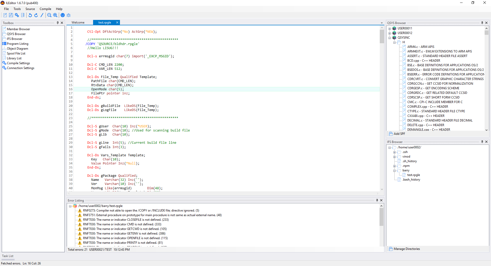
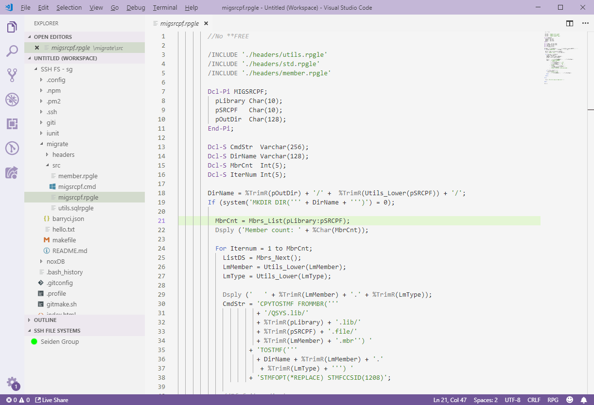

# Tooling

This chapter is going to be about getting the tooling required for development in the IFS and to use the SSH shell correctly. This is needed because in order to use tools, like `git` and `gmake`, you should have a correctly setup system.

## What is yum?

yum is a package manager which has been ported to IBM i. The intention behind yum was to replace the 5333OPS PTF group, which used to contain the open source tools such a `git`, `bash` and so on. With yum, you are now able to install those packages via the pase command line (and also Access Client Solutions).

There are multiple ways to install yum. 

### Installing with Access Client Solutions (ACS)

1. Download the latest release of Access Client Solutions
2. Access the Open Source Package Management Interface through the "Tools" Menu of ACS

### Online Install Instructions (without ACS Open Source Management Tool)

1. Open ACS Run SQL Scripts and connect to the IBM i you want to install to
2. Run the following script in Run SQL Scripts using "Run All" via Toolbar, Menu option, or Ctrl-Shift-A

```sql
create or replace table qtemp.ftpcmd(cmd char(240)) on replace delete rows;
create or replace table qtemp.ftplog(line char(240)) on replace delete rows;

insert into qtemp.ftpcmd(CMD) values 
   ('anonymous anonymous@example.com')
  ,('namefmt 1')
  ,('lcd /tmp')
  ,('cd /software/ibmi/products/pase/rpms')
  ,('bin')
  ,('get README.md (replace')
  ,('get bootstrap.tar.Z (replace')
  ,('get bootstrap.sh (replace')
  with nc
;

CL:OVRDBF FILE(INPUT) TOFILE(QTEMP/FTPCMD) MBR(*FIRST) OVRSCOPE(*JOB);
CL:OVRDBF FILE(OUTPUT) TOFILE(QTEMP/FTPLOG) MBR(*FIRST) OVRSCOPE(*JOB);

CL:FTP RMTSYS('public.dhe.ibm.com');

CL:QSH CMD('touch -C 819 /tmp/bootstrap.log; /QOpenSys/usr/bin/ksh /tmp/bootstrap.sh > /tmp/bootstrap.log 2>&1');

select
case when (message_tokens = X'00000000')
 then 'Bootstrapping successful! Review /tmp/README.md for more info'
 else 'Bootstrapping failed. Consult /tmp/bootstrap.log for more info'
end as result
from table(qsys2.joblog_info('*')) x
where message_id = 'QSH0005'
order by message_timestamp desc
fetch first 1 rows only;
```

You can also find this script online at ftp://public.dhe.ibm.com/software/ibmi/products/pase/rpms/bootstrap.sql.

## Before using yum / Setting up your home directory

Before anyone starts to use yum, git, ssh, etc, on your IBM i, it should be made clear that each user needs to setup their home directory in their user profile settings. Each user gets a home directory, which is where they would develop any code they write on the IBM i. It will be used in future chapters.

To change the user profile, firstly make a directory in the `/home` folder (which is in the root) which matches the name of their user profile. Case does not matter. The following are the commands which should be used from a 5250 session. For example, if my user name was `BARRY`.

```
MKDIR DIR('/home/BARRY')
CHGUSRPRF USRPRF(BARRY) HOMEDIR('/home/BARRY')
```

## Using yum

`yum` and the packages it install will install in `/QOpenSys/pkgs` (more specifically `/QOpenSys/pkgs/bin`). This means, in order to use `yum` you need to adjust your `$PATH` variable.

You can do it for your current SSH session using.

```
PATH=/QOpenSys/pkgs/bin:$PATH
```

You can do it permanently by appending that line to your users `.profile`, which is executed when you launch an SSH session.

```
PATH=/QOpenSys/pkgs/bin:$PATH >> $HOME/.profile
```

You may also want to launch `bash` when you start your session, in which you can just change your `.profile` for.


```
PATH=/QOpenSys/pkgs/bin:$PATH bash >> $HOME/.profile
```

When you install packages, only one user needs to install it as the `/QOpenSys/pkgs` directory is shared by everyone.

### General `yum` commands

* Install a package: `yum install <package>`
* Remove a package: `yum remove <package>`
* Search for a package: `yum search <package>`
* List installed packages: `yum list installed`
* List available packages: `yum list available`
* List all packages: `yum list all`

## Installing git

To install git, we must use the `yum` command once you have it setup.

```
yum install git.ppc64
```

After this, the `git` command will be available for your users to use.

## Tools for editing streamfiles

Of course, since all future development will take place in the IFS (that includes for RPG, COBOL, or any ILE language you use) you will need to use a sufficient editor. This section will cover different editors available for editing source code on the IFS.

### Rational Developer for i

Rational Developer for i (RDi) does have an IFS Browser where you can edit and compile ILE sources.

!!IMAGE HERE!!

Of course, from RDi, you can only compile sources from the IFS that have support for the SRCSTMF parameter. In RDi, like usual, you can setup your library list for the job that the source will compile under.

### ILEditor

ILEditor supports editing and compiling sources from the IFS. ILEditor is currently only available for Windows as it is built with .NET.



Like RDi, you can only compile sources from the IFS that have support for the SRCSTMF parameter. You can also setup the library list in the editor in the job settings window.

### VSCode + SSH FS extension

VSCode is such an amazing editor and we're lucky that there is extension called SSH FS (https://github.com/SchoofsKelvin/vscode-sshfs) which allows us to access files on a remote system - including IBM i, which is perfect for editing. Using this extension along the RPG extension for highlighting (created by Niels Liisberg), it's not too bad.



The true down side to using VSCode right now is that there is no inline compiling support. Of course you can save your file, then compile from the command line still.
