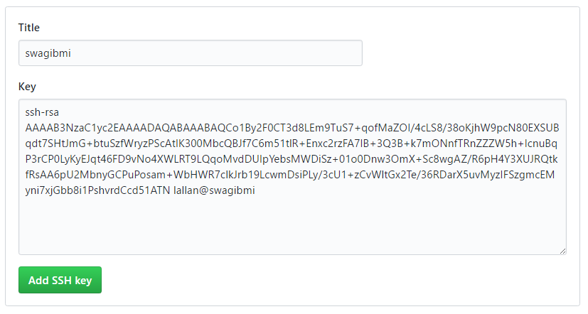
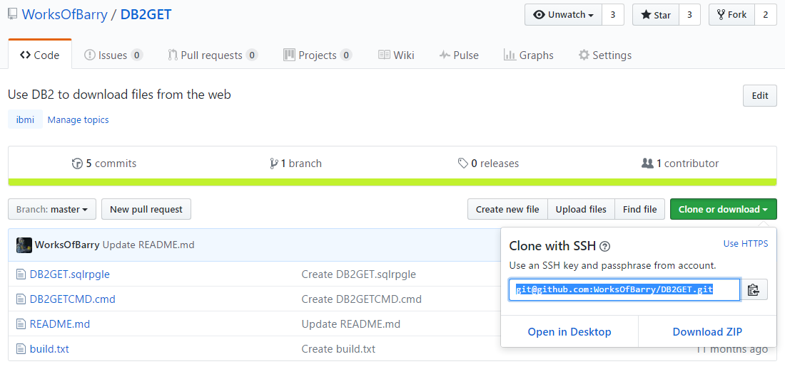

# Repository hosting

This section will describe the use between hosting git repositories on-premise or in the cloud. This section is needed as it should help you determine where to host your future repositories.

Before cloning any repositories, make sure you have your git configured with a name and email address.

## On-premise hosting

In the IBM i world, it's totally normal for people to host their code on-premise - maybe even across multiple servers. Storing multiple copies of source members across multiple libraries and systems can be dangerous as you could lose track of the latest versions. Automatically storing source in git is better because you can track different versions (and even for different systems using branching).

When using git, hosting on-premise works and some businesses do it. But of course, there should only be on master copy (the main bare repository). If the system that is hosting that master repository goes down, where are your developers going to push that code? You also take the risk that one of your developers might delete the master repository (although you hopefully have your system authorties setup correctly, for this not to happen!).

### Creating the bare repo

For each project, or application you have, you should create a bare repo for. The bare is the master repository and is the repository that users should clone into their home directories.

1. `cd /` - change working directory to the root
2. `git init --bare myproject` - this will create `/myproject` as an empty repository.

Developers can now clone this repository by using the following commands:

```
cd $HOME
git clone /myproject
```

This would create `/home/BARRY/myproject`. If developers want to clone it on to their local machine, or in fact want to clone it onto another IBM i, they can do it with SSH: `git clone barry@devibmi:/myproject`.

## Cloud hosted

Repositories hosted in the cloud are not only more secure, but they are also more user friendly. There are tones of benefits to hosting in the cloud:

* Easy to setup SSH keys
* Friendly UI to browse code, commit history, blame
* Easy to create and maintain branches (and pull requests)
* Easier to implement a CI/CD workflow
* Easier to clone onto different systems

I will highlight '**easier to clone onto different systems**'. If you use on-premise hosting and have multiple systems outside of your network, it's hard to clone repositories across networks. If it's hosted in the cloud, it's easy to replicate across multiple systems securely.

The real issue with cloud hosted repositories is selecting which cloud hosting to use. There are more than a few options, but the more popular hosting solutions are:

* GitHub
* BitBucket
* GitLab

Choosing one of those solutions generally comes down to a number of things:

* Price per user
* How easy their UI to use
* Which one has extra features (like issues) which might be useful to your business

### For this book

This book will mostly focus on GitHub as the solution of choice. This is because:

1. A very simplistic UI for the developers (for things like searching for code)
2. Easy to create code reviews on branches
3. Easy to assign tasks and reviews to users
4. Integrates with almost every CI/CD system
5. Easy to manage permissions for users on a per team or per project basis.

### Creating the repository online

For any cloud hosting repository provider, you need to setup a secure connection to their server to authenticate your user. To do this, you need to setup an SSH key from your IBM i to the cloud repository provider (e.g. GitHub, BitBucket, etc).

#### Creating an SSH key

Using GitHub as an example, on your IBM i that you will develop on:

1. `cd $HOME`
2. `ssh-keygen` - and follow the instructions:

```
Generating public/private rsa key pair.
Enter file in which to save the key (/home/BARRY/.ssh/id_rsa):
Created directory '/home/BARRY/.ssh'.
Enter passphrase (empty for no passphrase): [ENTER]
Enter same passphrase again: [ENTER]
Your identification has been saved in /home/BARRY/.ssh/id_rsa.
Your public key has been saved in /home/BARRY/.ssh/id_rsa.pub.
The key fingerprint is:
SHA256:EjLLnXBpN/+TQ55RnOP1xjWfpf5qQYSPem9BsVYGxo4 BARRY@swagibmi
The key's randomart image is:
+---[RSA 2048]----+
|             oo. |
|       .    .o+.o|
|    + = o    *=*+|
|   . O + o  EoB=B|
|    o + S ..o+o.=|
|       .  .+.=o. |
|           .B..o |
|             o+. |
|             o...|
+----[SHA256]-----+
```

3. The generated public key will exist at `/home/YOURUSER/.ssh/id_rsa.pub`. We need to copy the contents of this file onto our GitHub account. To get the contents use `cat /home/YOURUSER/.ssh/id_rsa.pub`

```
> cat /home/BARRY/.ssh/id_rsa.pub
ssh-rsa AAAAB3NzaC1yc2EAAAADAQABAAABAQCo1By2F0CT3d8LEm9TuS7+qofMaZOI/4cLS8/38o...
```

4. Log into your GitHub account and navigate to your account settings.
5. Select SSH and GPG keys from the bar on the left.
6. Hit the big green 'New SSH key' button. A new section should appear in which you can provide a title and the SSH key which we created earlier.
7. Give your key a name and then paste in the key we saw earlier - for example, the name could be the same as the IBM i system you're using.



8. Click 'Add SSH key' and you're done.

Each user will have to setup an SSH key - but they only need to do it once. If they regenerate a key, they will need to repeat the process.

#### Cloning the repository

Next, a single person will need to setup a repository on GitHub for a project/application. If you are a business, you may want to create the repository under an organisation in which you can your employees to - if it's a solo developer you can just create a regular repository.

You can grab the SSH clone URL from the repository you created by selecting the 'Clone or download' button and getting the SSH clone URL. For example:



Developers can then clone it onto any authorised machine using `git clone` followed by the SSH clone URL:

```
> cd $HOME
> git clone git@github.com:yourcompany/myproject.git
Cloning into 'myproject'...
```

This would create `/home/BARRY/myproject`.
