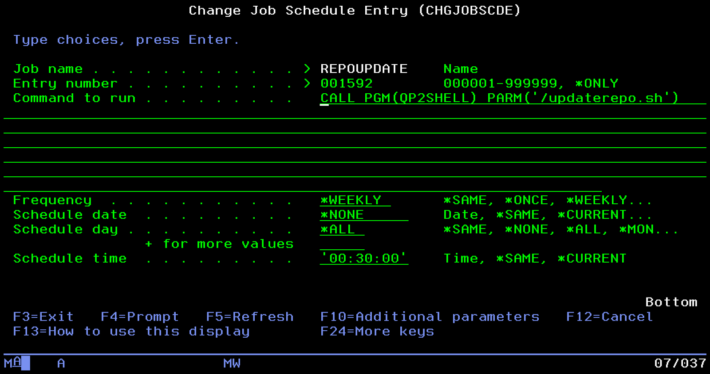

# Workflow overview

This chapter exists to go over the development workflow again. This will cover the master repository, where developers should be building objects and how the library list should be setup.

## Cloning repositories

```
                      +---------------------+
                      |                     |
            +---------+  Master Repository  +--------+
            |         |                     |        |
            |         +----------+----------+        |
            |                    |                   |
 +----------v-------+  +---------v--------+  +-------v----------+
 |                  |  |                  |  |                  |
 |  Developer Repo  |  |  Developer Repo  |  |  Developer Repo  |
 |                  |  |                  |  |                  |
 +------------------+  +------------------+  +------------------+
```

Every developer should be working out of their own cloned repository of the application they are working on, which would reside in a directory specific to that user (e.g. their home directory). Developers should not be sharing repositories. 

 A 'master library' represents a library mapped to a branch which always has the latest program changes. There may be multiple master libraries if you are working with a repository with multiple branches. Each developer should also have a developer library setup, where they can compile the programs, tables, etc, that they are working on to test. Developers should not ever compile into the master library.

## Making changes

When a developer wants to make a change to a program, they would simply make the changes to the source as they would expect, but they would:

* Build the new object into their developer library and not the master library
* Make sure that their developer library is higher than the master library in the library list when testing the application (so their changed objects are picked up first)
* Developers should not share 'developer libraries', they should each have their own.

When they are happy with the changes, they should commit and push them up. If you do not have any CI/CD in place: 

1. the master library may have to be rebuilt to pick up the new changes
2. the developer could replace the existing objects in the master library with the objects they changed in their developer library

A good reason to have CI/CD in place is to automatically keep master libraries up to date automatically, but there is also a way to achieve this in the base OS. It's always good to have a 'library' variable setup in your `makefile` so developers can build into their developer libraries, plus your CI/CD environment will probably want to make use of it:

* `gmake theprogram.rpgle BIN_LIB=#devlib`
* `gmake thetable.sql BIN_LIB=#devlib`

## Keeping master libraries up to date without CI/CD

It's possible to schedule a job to automatically update the master library every so often. First, you should clone a copy of the repository in a place where it will be rebuilt from, which developers will not access. You may want to create a directory in your root to do this. In that directory, is where a copy of your repositories will go that you want to build.

1. `mkdir /projects`
2. `cd /projects`
3. `git clone <url> myproject`

Next a developer will want to create a shell script to pull the latest changes and then trigger GNU Make to build the application, which will also specify the master library. For example, let's create `/projects/myproject.sh`

```shell
cd /myproject
git pull
gmake BIN_LIB=MYPROJ_MAS
```

Running this script should build the entire application into the specified library. An admin can then set this up to run as a scheduled job. If you wanted this to run nightly (like a nightly build of your application), you use the `ADDJOBSCDE` command and then update that scheduled job to run every night.

```
ADDJOBSCDE JOB(REPOUPDATE) CMD(CALL PGM(QP2SHELL) PARM('/projects/myproject.sh')) FRQ(*WEEKLY)
```


